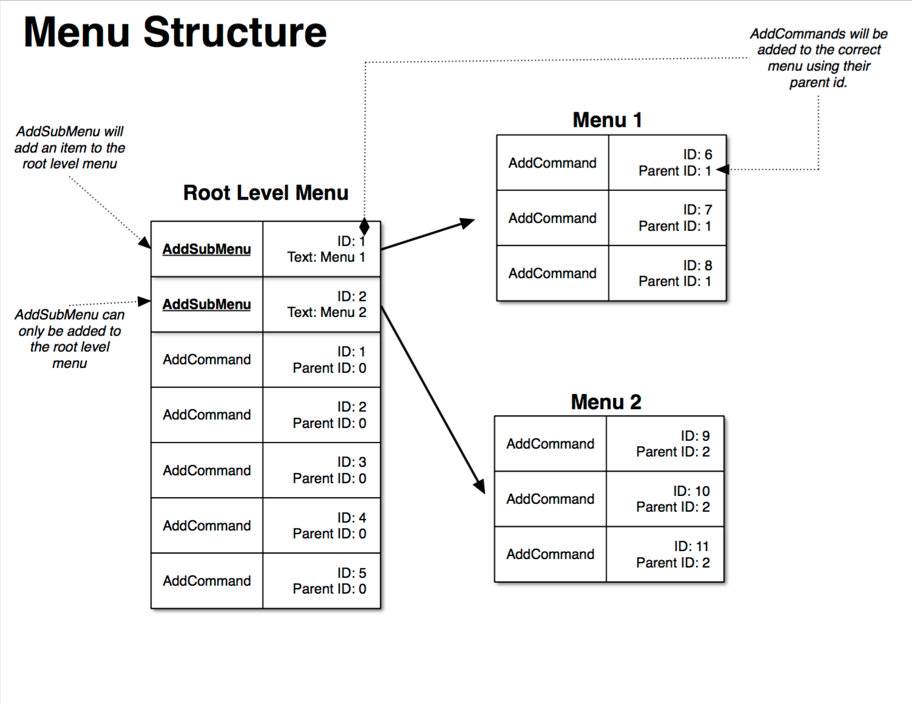

## Menus
You have two different options when creating menus. One is to simply add items to the default menu available in every template. The other is to create a custom menu that pops up when needed.

### Default Menu
##### Ford HMI
  
Every template has a default menu button. The position of this button varies between templates, and can not be removed from the template. The default menu is initially empty except for an "Exit Your App Name" button. Items can be added to the menu at the root level or to a submenu. It is important to note that a submenu can only be one level deep.

### Menu Structure


#### Add Menu Items
The `SDLAddCommand` RPC can be used to add items to the root menu or to a submenu. Each `SDLAddCommand` RPC must be sent with a unique id, a voice-recognition command, and a set of menu parameters. The menu parameters include the menu name, the position of the item in the menu, and the id of the menu item’s parent. If the menu item is being added to the root menu, then the parent id is 0. If it is being added to a submenu, then the parent id is the submenu’s id.

#### Objective-C
```objc
// Create the menu parameters
// The parent id is 0 if adding to the root menu
// If adding to a submenu, the parent id is the submenu's id
SDLMenuParams* menuParameters = [[SDLMenuParams alloc] initWithMenuName:@"Menu Item Name" parentId:0 position:0];

// For menu items, be sure to use unique ids.
SDLAddCommand* menuItem = [[SDLAddCommand alloc] initWithId:<#Unique Id#> vrCommands:@[@"<#Voice Recognition Command#>"] handler:^(SDLRPCNotification *notification) {
    if (![notification isKindOfClass:SDLOnCommand.class]) {
      return;
    }

    SDLOnCommand* onCommand = (SDLOnCommand*)notification;

    if ([onCommand.triggerSource isEqualToEnum:SDLTriggerSource.MENU]) {
      // Menu Item Was Selected
    }
}];

// Set the menu parameters
menuItem.menuParams = menuParameters;

[self.sdlManager sendRequest:menuItem withResponseHandler:^(SDLRPCRequest *request, SDLRPCResponse *response, NSError *error) {
    if ([response.resultCode isEqualToEnum:SDLResult.SUCCESS]) {
      // The menuItem was created successfully
    }
}];
```

#### Swift
```swift
// Create the menu parameters
// The parent id is 0 if adding to the root menu
// If adding to a submenu, the parent id is the submenu's id
let menuParameters = SDLMenuParams(menuName: "<#Menu Item Name#>", parentId: 0, position: 0)!

// For menu items, be sure to use unique ids.
let menuItem = SDLAddCommand(id: <#Unique Id#>, vrCommands: ["<#Voice Recognition Command#>"]) { (notification) in                     
  guard let onCommand = notification as? SDLOnCommand else {
    return
  }

  if onCommand.triggerSource == .menu() {
    // Menu Item Was Selected
  }
}!

// Set the menu parameters
menuItem.menuParams = menuParameters

sdlManager.send(menuItem) { (request, response, error) in
  if response?.resultCode == .success() {
      // The menuItem was created successfully
  }
}
```

#### Add a Submenu
To create a submenu, first send a `SDLAddSubMenu` RPC. When a response is received from the SDL Core, check if the submenu was added successfully. If it was, send an `SDLAddCommand` RPC for each item in the submenu.

#### Objective-C
```objc
SDLAddSubMenu* subMenu = [[SDLAddSubMenu alloc] initWithId:<#Unique Id#> menuName:@"<#SubMenu Item Name#>"];

[self.sdlManager sendRequest:subMenu withResponseHandler:^(SDLRPCRequest *request, SDLRPCResponse *response, NSError *error) {
  if ([response.resultCode isEqualToEnum:SDLResult.SUCCESS]) {
    // The submenu was created successfully, start adding the submenu items
  }
}];
```

#### Swift
```swift
let subMenu = SDLAddSubMenu(id: <#Unique Id#>, menuName: "<#SubMenu Item Name#>")!

sdlManager.send(subMenu) { (request, response, error) in
    if response?.resultCode == .success() {
        // The submenu was created successfully, start adding the submenu items
    }
})
```

#### Delete Menu Items
Use the cmdID of the menu item to tell the SDL Core which item to delete using the `SDLDeleteCommand` RPC.

#### Objective-C
```objc
SDLDeleteCommand* deleteMenuItem = [[SDLDeleteCommand alloc] initWithId:<#Id of Menu Item To Delete#>];

[self.sdlManager sendRequest:deleteMenuItem withResponseHandler:^(SDLRPCRequest *request, SDLRPCResponse *response, NSError *error) {
  if ([response.resultCode isEqualToEnum:SDLResult.SUCCESS]) {
    // The menu item was successfully deleted
  }
}];
```

#### Swift
```swift
let deleteMenuItem = SDLDeleteCommand(id: <#Id of Menu Item To Delete#>)!

sdlManager.send(deleteMenuItem) { (request, response, error) in
    if response?.resultCode == .success() {
        // The menu item was successfully deleted
    }
}
```

#### Delete Submenus
Use the menuID to tell the SDLCore which item to delete using the `SDLDeleteSubMenu` RPC.

#### Objective-C
```objc
SDLDeleteSubMenu* deleteSubMenu = [[SDLDeleteSubMenu alloc] initWithId:<#Id of Sub Menu Item to Delete#>];

[self.sdlManager sendRequest:deleteSubMenu withResponseHandler:^(SDLRPCRequest *request, SDLRPCResponse *response, NSError *error) {
  if ([response.resultCode isEqualToEnum:SDLResult.SUCCESS]) {
    // The sub menu was successfully deleted
  }
}];
```

#### Swift
```swift
let deleteSubMenu = SDLDeleteSubMenu(id: <#Id of Sub Menu Item to Delete#>)!

sdlManager.send(deleteSubMenu) { (request, response, error) in
    if response?.resultCode == .success() {
        // The sub menu was successfully deleted
    }
}
```  

### Custom Menus

Custom menus, called **perform interactions**, are one level deep, however, you can create submenus by triggering another perform interaction when the user selects a row in a menu. Perform interactions can be set up to recognize speech, so a user can select an item in the menu by speaking their preference rather than physically selecting the item.

 Perform interactions are created by sending two different RPCs. First a `SDLCreateInteractionChoiceSet` RPC must be sent. This RPC sends a list of items that will show up in the menu. When the request has been registered successfully, then a `SDLPerformInteraction` RPC is sent. The `SDLPerformInteraction` RPC sends the formatting requirements, the voice-recognition commands, and a timeout command.

#### Create a Set of Custom Menu Items
Each menu item choice defined in `SDLChoice` should be assigned a unique id. The choice set in `SDLCreateInteractionChoiceSet` should also have its own unique id.

#### Objective-C
```objc
SDLChoice* choice = [[SDLChoice alloc] initWithId:<#Unique Id#> menuName:@"<#Menu Title#>" vrCommands:@[@"<#Menu Commands#>"]];

SDLCreateInteractionChoiceSet* createRequest = [[SDLCreateInteractionChoiceSet alloc] initWithId:<#Unique Id#> choiceSet:@[choice]];

[self.sdlManager sendRequest:createRequest withResponseHandler:^(SDLRPCRequest *request, SDLRPCResponse *response, NSError *error) {
    if ([response.resultCode isEqualToEnum:SDLResult.SUCCESS]) {
      // The request was successful, now send the SDLPerformInteraction RPC
    }
}];
```

#### Swift
```swift
let choice = SDLChoice(id: <#Unique Id#>, menuName: "<#Menu Title#>", vrCommands: ["<#Menu Command#>"])!

let createRequest = SDLCreateInteractionChoiceSet(id: <#Unique Id#>, choiceSet: [choice])!

sdlManager.send(createRequest) { (request, response, error) in
    if response?.resultCode == .success() {
    		// The request was successful, now send the SDLPerformInteraction RPC
    }
}
```

#### Format the Set of Custom Menu Items
Once the set of menu items has been sent to SDL Core, send a `SDLPerformInteraction` RPC to get the items to show up on the HMI screen.

#### Objective-C
```objc
SDLPerformInteraction* performInteraction = [[SDLPerformInteraction alloc] initWithInitialPrompt:nil initialText:@"<#Text Displayed When Shown#>" interactionChoiceSetID:<#SDLCreateInteractionChoiceSet id#>];
```

#### Swift
```swift
let performInteraction = SDLPerformInteraction(initialPrompt: nil, initialText: "<#Text Displayed When Shown#>", interactionChoiceSetID: <#SDLCreateInteractionChoiceSet id#>)!
```

#### Interaction Mode
The interaction mode specifies the way the user is prompted to make a section and the way in which the user’s selection is recorded.

| Interaction Mode  | Description |
| ----------------- | ----------- |
| Manual only       | Interactions occur only through the display |
| VR only           | Interactions occur only through text-to-speech and voice recognition |
| Both              | Interactions can occur both manually or through VR |

#### Objective-C
```objc
performInteraction.interactionMode = SDLInteractionMode.MANUAL_ONLY;
```

#### Swift
```swift
performInteraction.interactionMode = .manual_ONLY()
```
#### VR Interaction Mode
##### Ford HMI


#### Manual Interaction Mode
##### Ford HMI


#### Interaction Layout
The items in the perform interaction can be shown as a grid of buttons (with optional images) or as a list of choices.

| Layout Mode      | Formatting Description |
| ---------------- | ---------------------- |
| Icon only        | A grid of buttons with images |
| Icon with search | A grid of buttons with images along with a search field in the HMI |
| List only        | A vertical list  of text |
| List with search | A vertical list of text with a search field in the HMI |
| Keyboard         | A keyboard shows up immediately in the HMI |

#### Objective-C
```objc
performInteraction.interactionLayout = SDLLayoutMode.LIST_ONLY;
```

#### Swift
```swift
performInteraction.interactionLayout = .list_ONLY()
```

#### Icon Only Interaction Layout
##### Ford HMI


#### List Only Interaction Layout
##### Ford HMI


#### List with Search Interaction Layout
##### Ford HMI


#### Text-to-Speech (TTS)
A text-to-speech chunk is a text phrase or prerecorded sound that will be spoken by the head unit. The text parameter specifies the text to be spoken or the name of the pre-recorded sound. Use the type parameter to define the type of information in the text parameter. The `SDLPerformInteraction` request can have a initial, timeout, and a help prompt.

#### Objective-C
```objc
SDLTTSChunk* ttsChunk = [[SDLTTSChunk alloc] initWithText:@"<#Text to Speak#>" type:SDLSpeechCapabilities.TEXT];
performInteraction.initialPrompt = [NSMutableArray arrayWithObject:ttsChunk];

// or - more easily

performInteraction.initialPrompt = [SDLTTSChunk textChunksFromString:@"<#Text to Speak#>"];
```

#### Swift
```swift
let ttsChunk = SDLTTSChunk(text: "<#Text to Speak#>", type: .text())
performInteraction.initialPrompt = NSMutableArray(array: [prompt!])

// or - more easily

performInteraction.initialPrompt = SDLTTSChunk.textChunks(from: "<#Text to Speak#>")
```

#### Timeout
The timeout parameter defines the amount of time the menu will appear on the screen before the menu is dismissed automatically by the HMI.

#### Objective-C
```objc
performInteraction.timeout = @30000; // 30 seconds
```

#### Swift
```swift
performInteraction.timeout = 30000 // 30 seconds
```

#### Send the Request
#### Objective-C
```objc
[self.sdlManager sendRequest:performInteraction withResponseHandler:^(SDLRPCRequest *request, SDLRPCResponse *response, NSError *error) {
    if (![response isKindOfClass:SDLPerformInteractionResponse.class]) {
        return;
    }
    SDLPerformInteractionResponse* performInteractionResponse = (SDLPerformInteractionResponse*)response;

    if ([performInteractionResponse.resultCode isEqualToEnum:SDLResult.TIMED_OUT]) {
        // The custom menu timed out before the user could select an item
    } else if ([performInteractionResponse.resultCode isEqualToEnum:SDLResult.SUCCESS]) {
        NSNumber* choiceId = performInteractionResponse.choiceID;
        // The user selected an item in the custom menu
    }
}];

```

#### Swift
```swift
sdlManager.send(performInteraction) { (request, response, error) in
    guard let performInteractionResponse = response as? SDLPerformInteractionResponse else {
        return;
    }


    // Wait for user's selection or for timeout
    if performInteractionResponse.resultCode == .timed_OUT() {
        // The custom menu timed out before the user could select an item
    } else if performInteractionResponse.resultCode == .success() {
        let choiceId = performInteractionResponse.choiceID
        // The user selected an item in the custom menu
    }
}
```

#### Delete the Custom Menu
If the information in the menu is dynamic, then the old interaction choice set needs to be deleted with a `SDLDeleteInteractionChoiceSet` RPC before the new information can be added to the menu. Use the interaction choice set id to delete the menu.

#### Objective-C
```objc
SDLDeleteInteractionChoiceSet* deleteRequest = [[SDLDeleteInteractionChoiceSet alloc] initWithId:<#SDLCreateInteractionChoiceSet id#>];

[self.sdlManager sendRequest:deleteRequest withResponseHandler:^(SDLRPCRequest *request, SDLRPCResponse *response, NSError *error) {
    if ([response.resultCode isEqualToEnum:SDLResult.SUCCESS]) {
      // The custom menu was deleted successfully
    }
}];
```

#### Swift
```swift
let deleteRequest = SDLDeleteInteractionChoiceSet(id: <#SDLCreateInteractionChoiceSet id#>)!

sdlManager.send(deleteRequest) { (request, response, error) in
    if response?.resultCode == .success() {
     	// The custom menu was deleted successfully
    }
}
```
