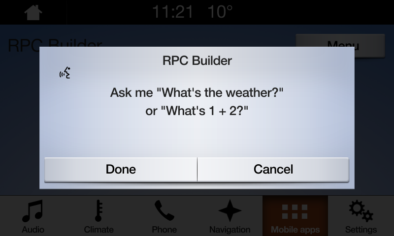

## Getting In-Car Audio

Capturing in-car audio allows developers to interact with users via raw audio data provided to them from the car's microphones. In order to gather the raw audio from the vehicle, we must leverage the [`SDLPerformAudioPassThru`](https://github.com/smartdevicelink/sdl_ios/blob/master/SmartDeviceLink/SDLPerformAudioPassThru.h) RPC.

!!! note
PerformAudioPassThru does not support automatic speech cancellation detection, so if this feature is desired, it is up to the developer to implement.
!!!

### Starting Audio Capture
To initiate audio capture, we must construct an `SDLPerformAudioPassThru` object. The properties we will set in this object's constructor relate to how we wish to gather the audio data from the vehicle we are connected to.

#### Objective-C
```objc
SDLPerformAudioPassThru *audioPassThru = [[SDLPerformAudioPassThru alloc] initWithInitialPrompt:@"Talk to me." audioPassThruDisplayText1:@"Ask me \"What's the weather?\"" audioPassThruDisplayText2:@"or \"What is 1 + 2?\"" samplingRate:SDLSamplingRate._16KHZ bitsPerSample:SDLBitsPerSample._16_BIT audioType:SDLAudioType.PCM maxDuration:1000000 muteAudio:YES];

[self.sdlManager sendRequest:audioPassThru];
```

#### Swift
```swift
let audioPassThru = SDLPerformAudioPassThru(initialPrompt: "Talk to me.", audioPassThruDisplayText1: "Ask me \"What's the weather?\"", audioPassThruDisplayText2: "or \"What is 1 + 2?\"", samplingRate: ._16KHZ(), bitsPerSample: ._8_BIT(), audioType: .pcm(), maxDuration: 1000000, muteAudio: true)!

sdlManager.send(audioPassThru) 
```

#### Ford HMI


In order to know the currently supported audio capture capabilities of the connected head unit, please refer to the `SDLRegisterAppInterfaceResponse`, which contains a property `audioPassThruCapabilities`.

!!! note
Currently, Ford's SYNC 3 vehicles only support Sampling Rates of 16 khz and Bit Rates of 16 bit.
!!!

### Gathering Audio Data

SDL provides audio data as fast as it can gather it, and sends it to the developer in chunks. In order to retrieve this audio data, the developer must:

**First**, register to observe the `SDLDidReceiveAudioPassThruNotification` notification: 

#### Objective-C
```objc
[[NSNotificationCenter defaultCenter] addObserver:self selector:@selector(onAudioPassThru:) name:SDLDidReceiveAudioPassThruNotification object:nil];
```

#### Swift
```swift
NotificationCenter.default.addObserver(self, selector: #selector(onAudioPassThru(_:)), name: .SDLDidReceiveAudioPassThru, object: nil)
```

**Then**, react to notification when Audio Data is received:

#### Objective-C
``` objc
- (void)onAudioPassThru:(SDLRPCNotificationNotification *)notification {
    if (![notification.notification isKindOfClass:SDLOnAudioPassThru.class]) {
        return;
    }
    
    SDLOnAudioPassThru *onAudioPassThru = (SDLOnAudioPassThru *)notification.notification;
    
    // Do something with current audio data.
    NSData *audioData = onAudioPassThru.bulkData;
}
```

#### Swift
```swift
func onAudioPassThru(_ notification: SDLRPCNotificationNotification) {
    guard let onAudioPassThru = notification.notification as? SDLOnAudioPassThru else {
        return
    }
    
    // Do something with current audio data.
    let audioData = onAudioPassThru.bulkData
}
```


!!! note
This audio data is only the current audio data, so the developer must be in charge of managing previously retrieved audio data.
!!!


### Ending Audio Capture
Perform Audio Pass Thru is a request that works in a different way when compared to other RPCs. For most RPCs, and request is followed by an immediate response, with whether that RPC was successful or not. This RPC, however, will only send out the response when the Perform Audio Pass Thru is ended.

Audio Capture can be ended in 4 ways:

1. Audio Pass Thru has timed out.

    If the audio passthrough has proceeded longer than the requested timeout duration, Core will end this request with a `resultCode` of `SUCCESS`. You should expect to handle this audio passthrough as though it was successful.

2. Audio Pass Thru was closed due to user pressing "Cancel".

    If the audio passthrough was displayed, and the user pressed the "Cancel" button, you will receive a `resultCode` of `ABORTED`. You should expect to ignore this audio pass through.

3. Audio Pass Thru was closed due to user pressing "Done".

    If the audio passthrough was displayed, and the user pressed the "Done" button, you will receive a `resultCode` of `SUCCESS`. You should expect to handle this audio passthrough as though it was successful.

4. Audio Pass Thru was ended due to the developer ending the request.

    If the audio passthrough was displayed, but you have established on your own that you no longer need to capture audio data, you can send an `SDLEndAudioPassThru` RPC.

#### Objective-C
```objc
SDLEndAudioPassThru *endAudioPassThru = [[SDLEndAudioPassThru alloc] init];
[self.sdlManager sendRequest:endAudioPassThru];
```

#### Swift
```swift
let endAudioPassThru = SDLEndAudioPassThru()!
sdlManager.send(endAudioPassThru)
```

You will receive a `resultCode` of `SUCCESS`, and should expect to handle this audio passthrough as though it was successful.

### Handling the Response
To process the response that we received from an ended audio capture, we have two approaches.

**First**,  Using the `withResponseHandler` property in `SDLManager`'s `send(_ :)` function.

#### Objective-C
```objc
[self.sdlManager sendRequest:performAudioPassThru withResponseHandler:^(__kindof SDLRPCRequest * _Nullable request, __kindof SDLRPCResponse * _Nullable response, NSError * _Nullable error) {
    if (error) {
        NSLog(@"Encountered Error sending Perform Audio Pass Thru: %@", error);
        return;
    }
    
    if (![response isKindOfClass:SDLPerformAudioPassThruResponse.class]) {
        return;
    }
    
    SDLPerformAudioPassThruResponse *audioPassThru = (SDLPerformAudioPassThruResponse *)response;
    SDLResult *resultCode = sendLocation.resultCode;
    if ([resultCode isEqualToEnum:SDLResult.SUCCESS]) {
        // Process audio data    
    } else {
        // Cancel any usage of the audio data
    }
}];
```

#### Swift
```swift
sdlManager.send(performAudioPassThru) { (request, response, error) in
    guard let response = response, let resultCode = response.resultCode else {
        return
    }
    
    if resultCode.isEqual(to: SDLResult.success()) {
        // Process audio data
    } else {
        // Cancel any usage of the audio data.
    }
}
```

**Or**, observe the `SDLDidReceivePerformAudioPassThruResponse` notification coming from `SDLNotificationConstants.h`:

**First**, register:

#### Objective-C
```objc
[[NSNotificationCenter defaultCenter] addObserver:self selector:@selector(audioPassThruResponse:) name:SDLDidReceivePerformAudioPassThruResponse object:nil];
```

#### Swift
```swift
NotificationCenter.default.addObserver(self, selector: #selector(audioPassThruResponse(_:)), name: SDLDidReceivePerformAudioPassThruResponse, object: nil)
```

**Then**, observe:

#### Objective-C
```objc
- (void)audioPassThruResponse:(SDLRPCResponseNotification *)notification {
    if (![notification.response isKindOfClass:SDLPerformAudioPassThruResponse.class]) {
        return;
    }
    
    SDLPerformAudioPassThruResponse *response = (SDLPerformAudioPassThruResponse *)notification.response;
    SDLResult *resultCode = response.resultCode;
    
    if ([resultCode isEqualToEnum:SDLResult.SUCCESS]) {
        // Process audio data
    } else {
        // Cancel any usage of the audio data
    }
}
```

#### Swift
```swift
func audioPassThruResponse(_ notification: SDLRPCResponseNotification) {
    guard let response = notification.response as? SDLPerformAudioPassThruResponse,
        let resultCode = response.resultCode else
         {
        return
    }
    
    if resultCode.isEqual(to: SDLResult.success()) {
        // Process audio data
    } else {
        // Cancel any usage of the audio data.
    }
}
```
