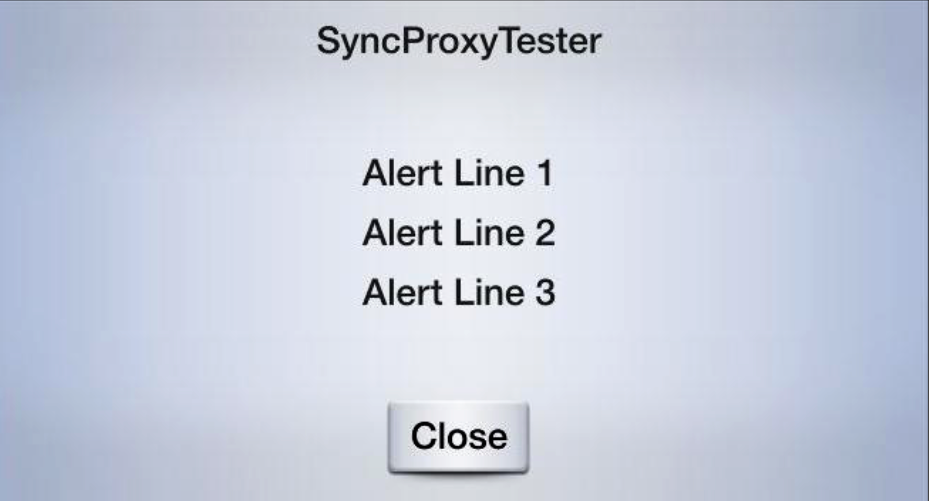

## Alerts

An alert is a pop-up window with some lines of text and optional soft buttons. When an alert is activated, it will abort any SDL operation that is in-progress, except the already-in-progress alert. If an alert is issued while another alert is still in progress, the newest alert will simply be ignored.

### Dismissing the Alert
The alert will persist on the screen until the timeout has elapsed, or the user dismisses the alert by selecting a button. There is no way to dismiss the alert programmatically other than to set the timeout length.

### Alert UI
Depending the platform, an alert can have up to three lines of text, a progress indicator (e.g. a spinning wheel or hourglass), and up to four soft buttons.

### Alert TTS
The alert can also be formatted to speak a prompt when the alert appears on the screen. Do this by setting the `ttsChunks` parameter. To play the alert tone before the text-to-speech is spoken, set `playTone` to `true`.

### Alert Templates
##### SDLAlert without soft buttons

##### SDLAlert with soft buttons


### Example
```swift
let alert = SDLAlert()!

// Alert text
alert.alertText1 = "line 1"
alert.alertText2 = "line 2"
alert.alertText3 = "line 3"

// Maximum time alert appears before being dismissed
// Timeouts are must be between 3-10 seconds
// Timeouts may not work when soft buttons are also used in the alert
alert.duration = 5000

// A progress indicator (e.g. spinning wheel or hourglass)
// Not all head units support the progress indicator
alert.progressIndicator = true

// Text-to-speech
let prompt = SDLTTSChunk()!
prompt.text = "An alert message for the Core to speak"
prompt.type = SDLSpeechCapabilities.text()
alert.ttsChunks = [prompt]

// Special tone played before the tts is spoken
alert.playTone = true

// Soft buttons
let okButton = SDLSoftButton()!
okButton.text = "OK"
okButton.type = SDLSoftButtonType.text()
okButton.softButtonID = 1
okButton.handler = { (notification) in
    guard let notification = notification as? SDLOnButtonPress else { return }
    guard let id = notification.customButtonID else { return }
    // create a custom action for the selected button
}
alert.softButtons = [okButton]

// Send the alert
self.sdlManager?.send(alert, withResponseHandler: { (request, response, error) in
    if response?.resultCode == SDLResult.success() {
        // alert was dismissed successfully
    }
})

```
